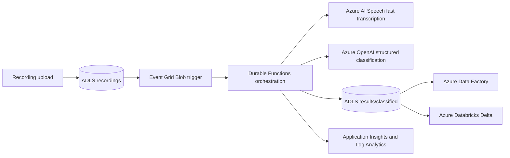

# Azure Audio Intelligence Pipeline

An event-driven Python solution for processing batches of call recordings without holding queue locks or running a polling server. Each uploaded recording starts an independent Durable Functions orchestration, Azure AI Speech performs fast transcription, Azure OpenAI returns a strict classification object, and ADLS Gen2 stores deterministic JSON for ADF or Databricks.

## Architecture



The workflow is at-least-once and idempotent. A recording ID is derived from the blob name and ETag. A duplicate event exits when `classified/{recording_id}.json` already carries the same source ETag; replacing a source blob creates a new independently traceable result.

## Processing Flow

1. Upload up to roughly 100 recordings to the `recordings` container.
2. The Event Grid Blob trigger starts one orchestration per new blob.
3. An activity downloads the recording with managed identity and posts it to the Speech fast transcription endpoint.
4. The call returns the transcript synchronously, so no job polling or durable timers are needed.
5. The transcript is classified into one configured category using Pydantic structured output.
6. JSON is written to `results/classified/<recording-id>.json` with the source ETag in metadata.
7. ADF or Databricks incrementally consumes the result files.

Activity concurrency is capped at 10 in `host.json`; Flex Consumption can scale to 10 instances. Fast transcription accepts audio under 2 hours and 250 MB; longer or larger recordings are rejected before upload. Speech throttling and transient 5xx responses receive bounded exponential retries.

## Prerequisites

- Python 3.11 or later
- Azure CLI and Bicep CLI
- Azure Functions Core Tools 4
- Permissions to create resources and role assignments in the target subscription
- For local Azure calls, `az login` with access to Storage, Speech, and Azure OpenAI

The checked subscription and `swedencentral` region support the requested resource types. Model quota is still consumed at deployment time and can change independently of regional support.

## Local Validation

Offline checks need no Azure resources and no configuration:

```powershell
python -m venv .venv
.\.venv\Scripts\Activate.ps1
python -m pip install -e ".[dev]"
python -m pytest -q
python -m ruff check src tests function_app.py
python -m compileall -q src function_app.py
```

## Local Run Against Azure

`scripts/local_test.py` runs local audio files through fast transcription and classification, skipping Event Grid, Durable Functions, and Blob Storage. It reads audio from a folder and writes result JSON to a folder, so no storage account is involved. It is the fastest way to confirm the Foundry endpoints work.

```powershell
Copy-Item .env.example .env    # then fill in the Foundry resource name
az login
python scripts\local_test.py                  # every file in samples\recordings
python scripts\local_test.py .\samples\recordings\call-0001-complaint.wav
```

Results land in `samples\results\<recording-id>.json`. Files that already have a result are skipped unless you pass `--force`; `--limit N` caps how many are processed, and `--output` overrides the destination folder. Defaults come from `LOCAL_INPUT_DIR` and `LOCAL_OUTPUT_DIR` in `.env`.

A single Microsoft Foundry resource serves both Speech and the chat model, so `SPEECH_ENDPOINT` (`https://<name>.cognitiveservices.azure.com`) and `AZURE_OPENAI_ENDPOINT` (`https://<name>.services.ai.azure.com/openai/v1`) use the same resource name. Both are data-plane endpoints — the portal's project URL (`.../api/projects/<project>`) targets the AI Projects SDK and is not accepted here. `AZURE_OPENAI_DEPLOYMENT` is the model deployment name. `.env` is git-ignored; commit changes to `.env.example` instead.

The signed-in user needs both `Cognitive Services User` and `Cognitive Services OpenAI User` on that Foundry resource, because `DefaultAzureCredential` falls back to Azure CLI locally. Generate sample audio with `scripts/New-SampleRecordings.ps1` if no recordings are on hand.

## Local Functions Host

The Functions host does not read `.env`. Copy `local.settings.example.json` to `local.settings.json`, replace the endpoint placeholders, then start the host:

```powershell
func start
```

Azurite can back the Durable Functions host, but the Event Grid source trigger and cloud Speech/OpenAI calls require Azure resources; upload-based end-to-end testing is the authoritative path.

## Deploy

The deployment script validates and shows ARM changes by default. It creates or changes resources only with `-Apply`.

```powershell
.\scripts\deploy.ps1 `
  -SubscriptionId "<subscription-guid>" `
  -ResourceGroupName "rg-audio-intelligence-dev"

# Review the what-if output, then deploy infrastructure and publish code.
.\scripts\deploy.ps1 `
  -SubscriptionId "<subscription-guid>" `
  -ResourceGroupName "rg-audio-intelligence-dev" `
  -Apply
```

Resource names are deterministic and follow `az<type><unique-token>`. The Bicep template deploys:

- ADLS Gen2 with shared-key and anonymous access disabled
- User-assigned managed identity
- Flex Consumption Function App using identity-based host and trigger connections
- Azure AI Speech with local authentication disabled
- Azure OpenAI with local authentication disabled and `gpt-5-mini` structured output deployment
- Application Insights backed by a 30-day Log Analytics workspace
- Function diagnostics plus Blob Owner/Contributor, Queue Contributor, Table Contributor, Monitoring Metrics Publisher, Cognitive Services User, and OpenAI User assignments

No Key Vault is created because the runtime has no stored secrets.

## Upload or Replay

Grant the operator `Storage Blob Data Contributor` on the storage account, then run:

```powershell
.\scripts\upload-recordings.ps1 `
  -StorageAccountName "<storage-account>" `
  -SourceDirectory "C:\recordings"
```

The script does not overwrite existing blobs. To intentionally reprocess a recording, upload it under a new name or replace it explicitly; the changed ETag generates a new recording ID. Do not delete a result merely to replay while an orchestration is still running.

## Result Contract

Each JSON file contains:

- `schema_version`
- source identity, blob path, ETag, and locale
- transcript text and duration
- category, confidence from 0 to 1, summary, rationale, and human-review flag
- UTC processing timestamp

Strict Pydantic models reject unknown fields. The model must choose from `CLASSIFICATION_CATEGORIES`; any other value fails the activity instead of silently contaminating downstream data.

## ADF and Databricks

For ADF, use an ADLS Gen2 linked service with managed identity, point a JSON dataset at `results/classified`, enable recursive reads, and copy into the existing bronze layer. Use `recording.recording_id` as the business key and `recording.etag` as the change token.

For Databricks, grant the workspace identity read access to the `results` container and adapt `examples/databricks_ingest.py`. The example applies an explicit schema and merges into Delta by recording ID, updating only when the source ETag changes. In production, use Auto Loader and a checkpoint directory rather than repeatedly scanning all JSON.

## Monitoring and Recovery

Track these signals in Application Insights:

- Failed `audio_orchestrator` instances
- Speech 429/5xx activity failures and retry exhaustion
- Classification refusals or schema failures
- End-to-end duration from orchestration start to result upload
- Result count compared with source recording count

Durable Functions preserves state across restarts. A transient activity failure follows Durable retry/replay semantics at the orchestration boundary; the Speech client separately retries request-level throttling. For poison inputs, inspect the failed orchestration and Speech error, correct the source/configuration, then replace or rename the blob. Low-confidence, ambiguous, safety, and compliance cases are written with `requires_human_review=true`.

Useful checks:

```powershell
az functionapp log tail --name "<function-app>" --resource-group "<resource-group>"
az storage blob list --account-name "<storage-account>" --auth-mode login --container-name results --prefix classified/ --output table
```

## Security Notes

- Runtime service calls use the user-assigned managed identity.
- Audio is read with managed identity and streamed directly to Speech, so no SAS URL is ever issued.
- Storage shared keys, Cognitive Services keys, and Azure OpenAI keys are disabled in Azure.
- Public endpoints remain enabled for a deployable baseline. Add private endpoints, VNet integration, private DNS, and restricted Storage networking when the landing-zone network is known.
- Treat transcripts and rationales as sensitive data. Apply retention, Purview classification, and regional/compliance controls required by the recording consent policy.

## Infrastructure Rule Report

- Region/SKU availability checked against the target subscription; `swedencentral` selected.
- Resource token uses `uniqueString(subscription().id, resourceGroup().id, location, environmentName)`.
- All resources use the `az<type><token>` naming form.
- Function App uses a user-assigned identity and Flex Consumption.
- Storage Blob Data Owner, Blob Data Contributor, Queue Data Contributor, Table Data Contributor, and Monitoring Metrics Publisher are assigned.
- Storage local authentication and anonymous Blob access are disabled.
- Function diagnostics are sent to Log Analytics.
- `main.bicep` and `main.parameters.json` are included.
- No Key Vault rule applies because no application secret is stored.
- Python v2 decorator discovery is used; generated binding metadata replaces checked-in legacy per-function `function.json` files.