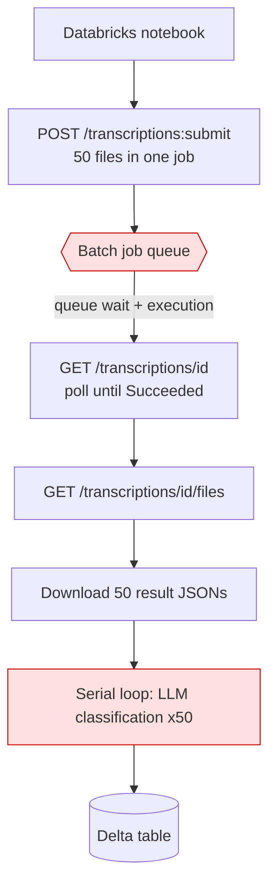
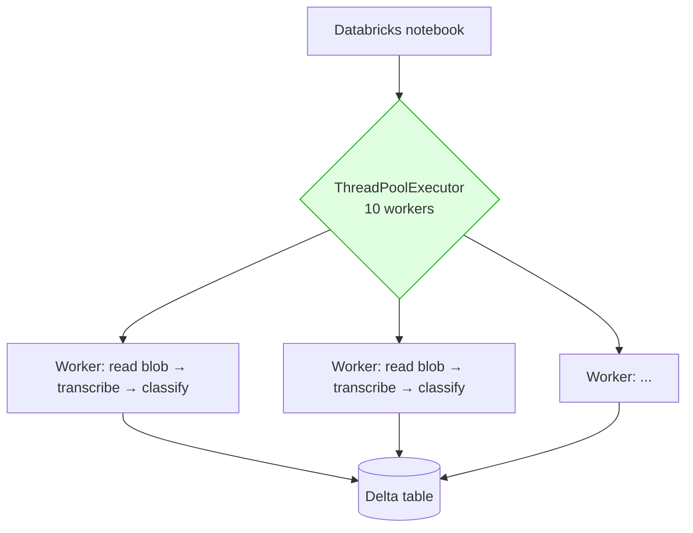

# Batch → Fast Transcription Migration (Databricks)

Reducing end-to-end latency for transcribe-then-classify pipelines running in Databricks notebooks against Azure AI Speech.

**Situation:** 50 recordings take ~20 minutes to transcribe and classify.
**Root cause:** Batch transcription queue latency plus two hard-serialized phases.
**Mitigation:** Fast Transcription + client-side parallelism + fused classification.
**Expected result:** ~20 minutes → ~2–4 minutes (5–10×).
**Cost of the change:** Transcription rate doubles ($0.18 → $0.36 per audio-hour).

---

## 1. Current situation

### As-is architecture



### Measured latency breakdown

| Phase | Time | Notes |
|---|---|---|
| `POST /transcriptions:submit` | seconds | Negligible |
| **Queue wait + job execution** | **~10–15 min** | 🔴 Dominant cost |
| `GET /files` + download results | ~30 s | |
| **Serial LLM classification** (50 × ~5 s) | **~4 min** | 🔴 Cannot start until the whole batch lands |
| **Total** | **≈ 20 min** | Matches observed behaviour |

### Why it is slow

Two structural problems, neither of which is fixed by tuning:

**① Batch transcription is an asynchronous job queue.** The wait is fixed overhead — it is broadly the same whether the job contains 5 files or 500. From the Azure AI Speech quota documentation:

> "Batch transcription and batch synthesis are asynchronous processes. They process jobs one by one in a queue. So, increasing the quota doesn't improve transcription performance."

Raising the batch quota will **not** help. The batch REST rate limit (100 requests / 10 s) is additionally **not adjustable**.

**② The pipeline is two serialized phases.** Classification cannot begin until every transcript has been retrieved. With 50 files this adds ~4 minutes of pure tail latency that is entirely avoidable.

Batch transcription is optimised for **throughput at volume**, not **latency at small batch size**. At 50 files, the workload sits in the worst part of that curve — paying full queue overhead while using almost none of the parallel capacity it buys.

---

## 2. Target state

### To-be architecture



No queue. No polling. Classification is pipelined per file rather than batched behind transcription.

### Projected latency

| | Today (Batch) | After (Fast + 10 workers + fused) |
|---|---|---|
| Queue wait | 10–15 min | **0** |
| Transcription | inside queue | ~10–20 s per file, in parallel |
| Classification | serial, after all files | overlapped, per file |
| **End-to-end, 50 recordings** | **~20 min** | **~2–4 min** |

> Validate with a pilot on real audio. Per-file transcription latency scales with recording duration — Fast Transcription is faster than real time, but not instant.

---

## 3. Required changes

### ① Collapse three API calls into one

**Before**

```text
POST /speechtotext/transcriptions:submit          → job id
GET  /speechtotext/transcriptions/{id}            → poll until "Succeeded"    ← delete
GET  /speechtotext/transcriptions/{id}/files      → download each result      ← delete
```

**After**

```text
POST /speechtotext/transcriptions:transcribe?api-version=2025-10-15
Content-Type: multipart/form-data
  audio:      <raw bytes>
  definition: {"locales":["en-US"],
               "profanityFilterMode":"Masked",
               "diarization":{"enabled":true,"maxSpeakers":2}}
→ 200 OK, transcript returned inline
```

Same endpoint host, same authentication, same `api-version`. The polling loop and result-download step are deleted outright.

### ② Audio delivery flips from SAS URL to raw bytes

The largest practical change in a notebook context.

| | Batch | Fast |
|---|---|---|
| How the service obtains audio | Caller supplies `contentUrls` (SAS); service pulls from storage | **Caller POSTs the bytes** |
| Notebook handles audio bytes | No | **Yes — read from ADLS into memory** |
| SAS token minting required | Yes | **No** ✅ simplification |

Memory planning: a 5-minute 16 kHz mono WAV is roughly 9.6 MB. Ten concurrent workers hold ~96 MB on the driver — immaterial. Read **lazily inside each worker**; do not `.collect()` all files up front.

### ③ Response schema is different — breaks silently if missed ⚠️

| Batch field | Fast Transcription equivalent |
|---|---|
| `combinedRecognizedPhrases[0].display` | `combinedPhrases[0].text` |
| `combinedRecognizedPhrases[0].lexical` | ❌ **not available** |
| `recognizedPhrases[].nBest[0].display` | `phrases[].text` |
| `recognizedPhrases[].nBest[0].confidence` | `phrases[].confidence` |
| `recognizedPhrases[].offsetInTicks` (100 ns) | `phrases[].offsetMilliseconds` |
| `recognizedPhrases[].durationInTicks` | `phrases[].durationMilliseconds` |
| `recognizedPhrases[].speaker` | `phrases[].speaker` |
| `duration` (ISO 8601, e.g. `PT5M30S`) | `durationMilliseconds` (integer) |

Tick conversion where needed: `milliseconds = ticks / 10_000`.

> 🔴 **Fast Transcription returns display form only.** Per Microsoft documentation: *"Unlike the batch transcription API, fast transcription API only produces transcriptions in the display (not lexical) form."* Any downstream consumer of `lexical` — keyword spotting, text normalisation, custom scoring — will break.

### ④ Parallelism moves from server-side to client-side

This is the conceptual shift and the actual source of the speedup.

| | Batch | Fast |
|---|---|---|
| Unit of work | 1 job, N files | 1 request, 1 file |
| Who parallelises | The service, internally | **The caller** |
| Client code shape | Single serial poll loop | Concurrent worker pool |

> ⚠️ **Failure mode:** a naive serial `for` loop over 50 files at ~15 s each is **12.5 minutes** — barely better than today. Without client-side concurrency the migration does not deliver its benefit.

**Recommended for this scale:** `ThreadPoolExecutor` on the driver, 8–16 workers. Simple, debuggable, no Spark serialisation concerns.

**For future scale (thousands of files):** Spark `mapPartitions` or a pandas UDF to distribute across executors. Cap total concurrency explicitly or the request-rate ceiling will be exceeded.

### ⑤ Fuse transcription and classification

```text
Before:  [transcribe ALL 50] ──wait for all── [classify ALL 50]
After:   per file: transcribe → classify → emit      (all files concurrently)
```

Classification now overlaps transcription instead of queuing behind it. This removes roughly 4 minutes **on its own**, independently of the API change.

The existing LLM classification function is **unchanged** — only its call site moves inside the per-file task.

### ⑥ Error handling shifts from job-level to per-request

Batch reports per-file failures in the result manifest at the end of the job. With Fast Transcription every individual call can fail, and one bad file must not abort the run.

Required:

- `try` / `except` around each file
- Retry on `429, 500, 502, 503, 504`
- Honour the `Retry-After` response header
- Exponential backoff, capped (e.g. 30 s)
- Per-file dead-letter list surfaced at the end of the run

### ⑦ Add idempotency

Batch re-runs re-transcribe everything. Per-file processing makes it cheap to skip completed work — check for an existing result keyed on `blob_name + etag` before spending on transcription and classification.

---

## 4. Reference implementation

```python
import concurrent.futures, json, time
import requests
from azure.identity import DefaultAzureCredential
from azure.storage.blob import BlobServiceClient

SPEECH_ENDPOINT = "https://<resource>.cognitiveservices.azure.com"
API_VERSION     = "2025-10-15"
MAX_WORKERS     = 10

cred  = DefaultAzureCredential()
blobs = BlobServiceClient("https://<account>.blob.core.windows.net", cred)


def _headers():
    # Alternative: {"Ocp-Apim-Subscription-Key": dbutils.secrets.get("kv", "speech-key")}
    token = cred.get_token("https://cognitiveservices.azure.com/.default")
    return {"Authorization": f"Bearer {token.token}"}


def transcribe(audio: bytes, filename: str, locale: str = "en-US"):
    definition = {
        "locales": [locale],
        "profanityFilterMode": "Masked",
        "diarization": {"enabled": True, "maxSpeakers": 2},
    }
    delay = 1.0
    for _ in range(6):
        response = requests.post(
            f"{SPEECH_ENDPOINT}/speechtotext/transcriptions:transcribe?api-version={API_VERSION}",
            headers=_headers(),
            files={"audio": (filename, audio, "application/octet-stream")},
            data={"definition": json.dumps(definition)},
            timeout=600,
        )
        if response.status_code not in (429, 500, 502, 503, 504):
            response.raise_for_status()
            body = response.json()
            text = "\n".join(p.get("text", "") for p in body.get("combinedPhrases", [])).strip()
            return text, body.get("durationMilliseconds", 0)
        time.sleep(float(response.headers.get("retry-after", delay)))
        delay = min(delay * 2, 30)
    raise RuntimeError("fast transcription failed after retries")


def process(blob_name: str):
    try:
        audio = blobs.get_blob_client("recordings", blob_name).download_blob().readall()
        text, duration_ms = transcribe(audio, blob_name.rsplit("/", 1)[-1])
        return {
            "blob": blob_name,
            "text": text,
            "duration_ms": duration_ms,
            "classification": classify(text),   # existing LLM call, unchanged
        }
    except Exception as exc:
        return {"blob": blob_name, "error": str(exc)}


with concurrent.futures.ThreadPoolExecutor(max_workers=MAX_WORKERS) as pool:
    results = list(pool.map(process, blob_names))

failed = [r for r in results if "error" in r]
print(f"{len(results) - len(failed)} succeeded, {len(failed)} failed")
```

`requests`, `azure-identity`, and `azure-storage-blob` are available on Databricks Runtime; pin them on the cluster if reproducibility matters.

---

## 5. Pre-flight blockers

Validate **before** committing to the migration. Any red item changes the recommendation.

| Check | Batch | Fast | Impact |
|---|---|---|---|
| Custom speech model in use? | ✅ supported | ⚠️ reported unsupported | 🔴 **Blocker** — verify with account team; a `Custom - Fast Transcription` meter exists at $0.45/audio-hour, which contradicts the public guidance |
| Downstream consumer of `lexical` output? | ✅ | ❌ display form only | 🔴 **Blocker** |
| Any file larger than 500 MB? | 1 GB limit | **< 500 MB** | 🟠 Requires splitting |
| Any recording longer than 5 hours? | 5 h | < 5 h | 🟠 Uncommon for contact-centre audio |
| Stereo audio with diarization? | Mono only | Mono only | 🟡 No change either way — use channel separation for stereo |
| Request-rate headroom | 600 RPM, **not** adjustable | 600 RPM, **adjustable** | 🟢 Fast is the better position |

At 50 recordings the workload is roughly **1 request per minute against a 600 RPM ceiling** — rate limiting is a non-issue at this scale.

---

## 6. Cost impact

Azure AI Speech, Sweden Central, retail list price, per audio-hour. Verified against the Azure Retail Prices API.

| Meter | Rate | 50 recordings × 5 min (4.17 audio-hours) |
|---|---|---|
| S1 Speech to Text Batch | $0.18 | $0.75 |
| **Fast Transcription Speech To Text** | **$0.36** | **$1.50** |

**Fast Transcription is exactly 2× the batch rate.** Billing is by audio duration (prorated), not file size or request count.

At pilot scale the delta is **$0.75** — immaterial. State it plainly regardless: the trade is a **5–10× latency improvement for a 2× transcription rate**.

At sustained production volume the multiplier becomes material and warrants a commitment-tier conversation:

| Commitment tier | Monthly | Included hours | Effective rate |
|---|---|---|---|
| 2K | $480 | 2,000 | $0.240 |
| 10K | $1,950 | 10,000 | $0.195 |
| 50K | $7,500 | 50,000 | $0.150 |
| 100K | $12,000 | 100,000 | $0.120 |

> ⚠️ Commitment meters are named `Commitment Tier STT AddOn …` and are distinct from the `Fast Transcription Speech To Text` meter. **Applicability to Fast Transcription must be confirmed with the account team before being quoted.**

---

## 7. Migration checklist

- [ ] Confirm no custom speech model dependency
- [ ] Confirm no downstream dependency on `lexical` output or `nBest` alternatives
- [ ] Confirm no source file exceeds 500 MB or 5 hours
- [ ] Replace submit/poll/fetch with the single `:transcribe` call
- [ ] Switch audio delivery from SAS URLs to in-request bytes
- [ ] Re-map response fields (`combinedPhrases[].text`, `durationMilliseconds`, `phrases[]`)
- [ ] Add `ThreadPoolExecutor` with 8–16 workers
- [ ] Move the LLM classification call inside the per-file worker task
- [ ] Add per-file retry (`429`/`5xx`, `Retry-After`, capped backoff) and dead-lettering
- [ ] Add idempotency check on `blob_name + etag`
- [ ] Benchmark A/B on the same 50 recordings and record the actual delta
- [ ] Size the cost impact against real production volume, not pilot volume

---

## 8. Talk track

> The 20 minutes is not processing time — it is queue time. Batch transcription is an asynchronous job queue, and that wait is fixed whether you submit 5 files or 500. Raising the quota does not help; the Azure documentation states this explicitly.
>
> Fast Transcription is synchronous — there is no queue. Combined with running files in parallel and classifying each one as it completes rather than waiting for the entire batch, you should land at 2–4 minutes instead of 20.
>
> The changes are contained. One API call replaces three, you send audio bytes instead of SAS URLs, you re-map the response fields, and you add a thread pool. Your LLM classification code does not change at all.
>
> Transcription costs twice as much per hour — about 75 cents extra for a 50-file run. Two things to confirm first: are you using a custom speech model, and does anything downstream read the lexical transcript? Either one would change the recommendation.

---

## 9. References

| Topic | Source |
|---|---|
| Fast Transcription API | Azure AI Speech — Fast transcription REST API, `api-version=2025-10-15` |
| Batch queue behaviour | Azure AI Speech — Service quotas and limits |
| Display vs lexical form | Azure AI Speech — Fast transcription overview |
| Pricing | Azure Retail Prices API — `serviceName = 'Foundry Tools'`, `productName = 'Azure Speech'`, `armRegionName = 'swedencentral'` |
| Working Fast Transcription client | [`src/audio_pipeline/speech.py`](../../src/audio_pipeline/speech.py) in this repository |
| Delta ingestion pattern | [`examples/databricks_ingest.py`](../../examples/databricks_ingest.py) in this repository |
